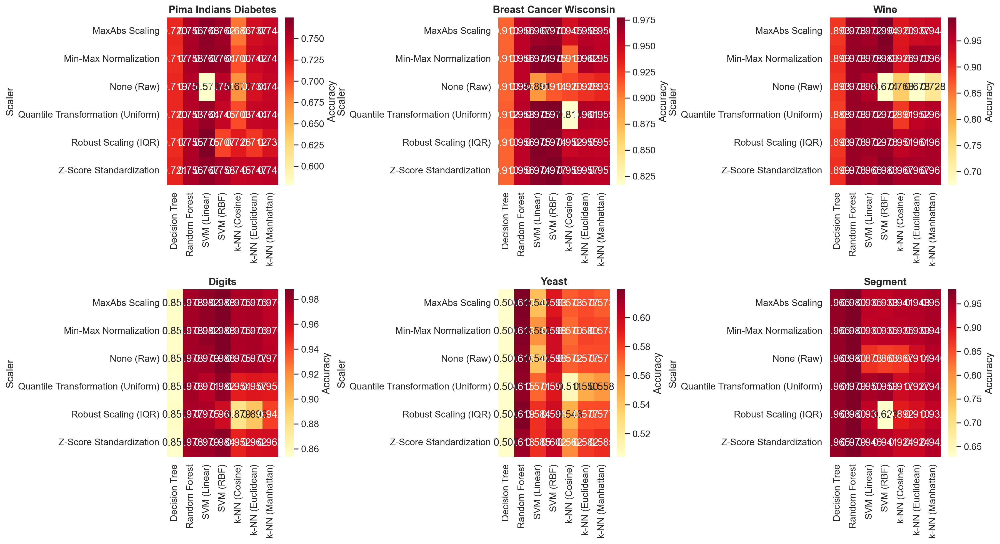
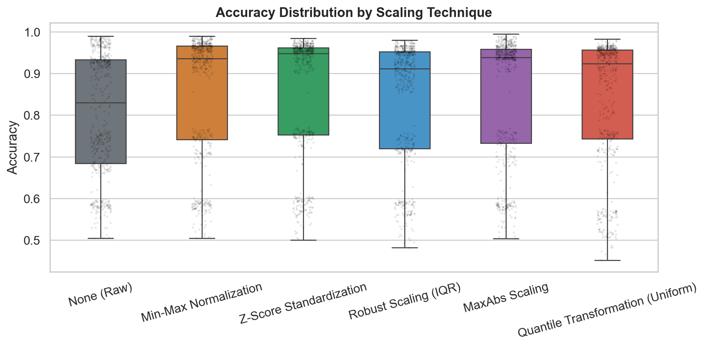
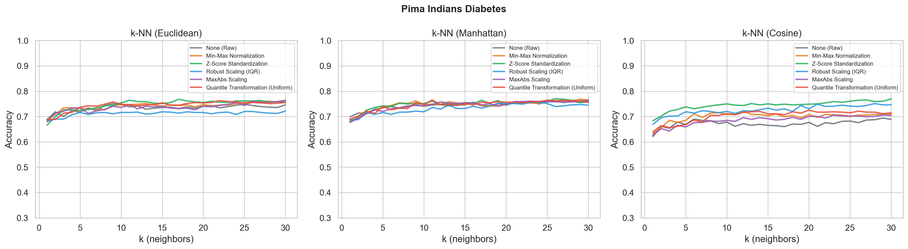

# Evaluasi Komparatif Teknik Feature Scaling pada Berbagai Klasifier dan Domain Data

**Amri Reza Wahyudin\*¹, Sri Murdiawati², Juan Adi Putra², Erliyan Redy Susanto²**

¹,²,³,⁴ Magister Ilmu Komputer, Fakultas Teknik dan Ilmu Komputer, Universitas Teknokrat Indonesia

\*_Penulis korespondensi:_ amri_reza_wahyudin@teknokrat.ac.id

---

## Abstrak

Feature scaling merupakan tahapan prapemrosesan yang kritis pada algoritma machine learning berbasis jarak, namun belum terdapat konsensus mengenai teknik penskalaan mana yang memberikan performa terbaik pada berbagai klasifier dan domain data. Penelitian ini menyajikan evaluasi komparatif komprehensif antara tiga teknik feature scaling—Normalisasi Min-Max, Standarisasi Z-Score, dan Robust Scaling (IQR)—serta baseline tanpa penskalaan pada empat dataset benchmark (Pima Indians Diabetes, Breast Cancer Wisconsin, Wine, dan Digits) dan tujuh klasifier (k-NN dengan jarak Euclidean, Manhattan, dan Cosine; SVM dengan kernel Linear dan RBF; Decision Tree; serta Random Forest). Sebanyak 1.504 evaluasi eksperimental dilakukan dengan validasi statistik menggunakan uji Wilcoxon signed-rank berpasangan. Hasil penelitian menunjukkan bahwa Standarisasi Z-Score dan Normalisasi Min-Max tidak berbeda signifikan secara statistik secara keseluruhan (p=0,71), dan keduanya mengungguli baseline tanpa penskalaan secara signifikan (p<0,001). Namun, pemilihan teknik penskalaan yang optimal sangat bergantung pada domain data: Z-Score unggul pada data medis dengan pencilan, Min-Max memberikan performa terbaik pada ruang fitur terbatas, dan data mentah sudah memadai ketika fitur memiliki skala alami yang seragam. Penelitian ini memberikan rekomendasi praktis bagi praktisi dan mengidentifikasi Robust Scaling sebagai pilihan aman ketika distribusi data tidak diketahui.

**Kata kunci:** feature scaling, normalisasi, standarisasi, robust scaling, k-nearest neighbors, SVM, studi komparatif

---

## 1. Pendahuluan

Algoritma k-Nearest Neighbors (k-NN) dikenal secara luas sebagai salah satu metode klasifikasi yang paling intuitif dalam ranah kecerdasan buatan, di mana prinsip utamanya bertumpu pada kedekatan posisi data dalam ruang multidimensi [1, 2]. Namun, efektivitas k-NN—dan seluruh klasifier berbasis jarak—sangat bergantung pada representasi skala fitur. Dalam dataset empiris, fitur sering kali memiliki satuan dan rentang nilai yang sangat berbeda, seperti perbedaan antara usia (0-100) dan pendapatan (0-10⁶), yang menimbulkan tantangan mendasar: fitur dengan magnitudo lebih besar secara matematis akan mendominasi perhitungan jarak tanpa memperhatikan signifikansi prediktifnya [3, 4, 5].

Permasalahan ini tidak terbatas pada k-NN. Support Vector Machines (SVM) juga sensitif terhadap skala fitur karena parameter regularisasi memberikan penalti secara seragam pada koefisien, sehingga fitur tanpa penskalaan dengan rentang lebih besar menerima bobot yang lebih kecil secara tidak proporsional. Model berbasis pohon (Decision Tree, Random Forest) secara teoretis bersifat scale-invariant karena melakukan pemisahan berdasarkan threshold per fitur secara independen—namun dalam praktiknya, interaksi antara penskalaan dan optimasi berbasis gradien pada metode ensemble tetap dapat mempengaruhi performa [6].

Meskipun pentingnya feature scaling telah diketahui secara luas, literatur machine learning masih kekurangan benchmark komprehensif yang secara simultan membandingkan beberapa teknik penskalaan pada berbagai famili klasifier. Studi-studi yang ada cenderung berfokus pada perbandingan sempit: Min-Max versus Z-Score pada satu algoritma [7, 8], atau satu teknik penskalaan pada beberapa algoritma [9]. Belum ada studi sebelumnya yang secara sistematis membandingkan tiga teknik penskalaan pada empat famili klasifier dengan validasi statistik.

Penelitian ini mengisi celah tersebut dengan melakukan evaluasi komparatif berskala besar yang menjawab tiga pertanyaan penelitian:

1. **RQ1:** Teknik penskalaan mana yang menghasilkan performa klasifikasi terbaik secara keseluruhan?
2. **RQ2:** Apakah teknik penskalaan optimal bergantung pada tipe klasifier?
3. **RQ3:** Apakah teknik penskalaan optimal bergantung pada domain data?

Kami juga memperkenalkan Robust Scaling (IQR) sebagai teknik ketiga—suatu metode yang dikenal tangguh terhadap pencilan namun jarang dibandingkan dengan Min-Max dan Z-Score dalam studi komparatif.

---

## 2. Studi Terkait

### 2.1 Dasar-Dasar Feature Scaling

Feature scaling mentransformasikan rentang numerik fitur ke skala yang umum tanpa mendistorsi perbedaan rentang nilai. Terdapat tiga pendekatan dominan:

**Normalisasi Min-Max** secara linear mentransformasi ulang fitur ke rentang tetap, biasanya [0, 1]:

$$x_{\text{norm}} = \frac{x - x_{\min}}{x_{\max} - x_{\min}}$$

Metode ini mempertahankan bentuk distribusi asli namun sangat sensitif terhadap pencilan, karena nilai ekstrem akan memampatkan data lainnya ke dalam sub-rentang yang sempit.

**Standarisasi Z-Score** memusatkan fitur sehingga memiliki rata-rata nol dan variansi satu:

$$x_{\text{std}} = \frac{x - \mu}{\sigma}$$

Berbeda dengan Min-Max, Z-Score tidak membatasi nilai ke rentang tetap, sehingga lebih tangguh terhadap pencilan sambil mempertahankan informasi tentang jarak relatif dari rata-rata.

**Robust Scaling** menggunakan median dan rentang interkuartil (IQR):

$$x_{\text{robust}} = \frac{x - \text{median}(x)}{\text{IQR}(x)}$$

Dengan menggunakan statistik yang tangguh, metode ini secara teoretis paling resilien terhadap pencilan [10], namun paling jarang diteliti dalam benchmark komparatif.

### 2.2 Studi Komparatif Sebelumnya

Pagan dkk. [5] meneliti dampak Min-Max, Z-Score, dan decimal scaling pada k-NN di sepuluh dataset, menemukan bahwa pemilihan teknik penskalaan secara signifikan mempengaruhi performa namun bervariasi antar dataset. Henderi dkk. [7] membandingkan Min-Max dan Z-Score pada k-NN untuk klasifikasi kanker payudara, melaporkan superioritas Min-Max (98% vs 97%). Firmansyah dan Astuti [9] membandingkan standarisasi dan normalisasi pada k-NN untuk klasifikasi stroke.

Namun, studi-studi tersebut memiliki keterbatasan yang serupa: perbandingan terbatas pada satu klasifier (k-NN), jarang menyertakan Robust Scaling, dan tidak menyediakan pengujian signifikansi statistik. Penelitian kami mengatasi keterbatasan ini dengan memperluas perbandingan ke tujuh klasifier, menambahkan Robust Scaling, dan memvalidasi temuan dengan uji Wilcoxon signed-rank.

---

## 3. Metodologi

### 3.1 Dataset

Empat dataset klasifikasi benchmark dipilih untuk merepresentasikan domain dan karakteristik data yang beragam:

| Dataset | Domain | Sampel | Fitur | Kelas | Dist. Kelas | Karakteristik |
|---------|--------|:------:|:-----:|:----:|:-----------:|--------------|
| Pima Indians Diabetes | Medis | 768 | 8 | 2 | 500/268 | Variansi tinggi, nilai nol invalid, pencilan |
| Breast Cancer Wisconsin | Medis | 569 | 30 | 2 | 357/212 | Dimensi tinggi, terpisah baik |
| Wine (kelas 0 vs lain) | Kimia | 178 | 13 | 2 | 119/59 | Sampel kecil, pengukuran terbatas |
| Digits (genap vs ganjil) | Citra | 1797 | 64 | 2 | 906/891 | Piksel skala alami (0-16) |

Dataset Pima Indians Diabetes mengandung nilai nol yang tidak valid secara biologis pada fitur seperti Glucose dan BMI, yang diimputasi menggunakan median (konsisten dengan pendekatan prapemrosesan pada [11]). Dataset Wine dibinarisasi (kelas 0 vs kelas 1 dan 2) untuk menjaga konsistensi klasifikasi biner di seluruh eksperimen. Digits dibinarisasi sebagai digit genap versus ganjil.

### 3.2 Teknik Penskalaan

Empat konfigurasi penskalaan dievaluasi:

| Scaler | Teknik | Rentang | Ketahanan Outlier |
|--------|--------|:-------:|:-----------------:|
| None (Mentah) | Tanpa transformasi | Asli | Tidak ada |
| Min-Max | $x_{\text{norm}} = (x - x_{\min})/(x_{\max} - x_{\min})$ | [0, 1] | Rendah |
| Z-Score | $x_{\text{std}} = (x - \mu)/\sigma$ | Tak terbatas | Sedang |
| Robust | $x_{\text{robust}} = (x - \text{med})/\text{IQR}$ | Tak terbatas | Tinggi |

### 3.3 Klasifier

Tujuh klasifier dievaluasi:

1. **k-NN (Euclidean)** — k=1 hingga 30, metrik jarak default
2. **k-NN (Manhattan)** — k=1 hingga 30, jarak L1
3. **k-NN (Cosine)** — k=1 hingga 30, cosine similarity
4. **SVM (Linear)** — kernel linear, probability estimates diaktifkan
5. **SVM (RBF)** — kernel radial basis function, probability estimates diaktifkan
6. **Decision Tree** — algoritma CART, parameter default
7. **Random Forest** — 100 estimator, parameter default

Untuk varian k-NN, seluruh 30 nilai k diuji untuk menangkap sensitivitas terhadap ukuran lingkungan. Klasifier non-kNN menggunakan parameter default scikit-learn.

### 3.4 Protokol Eksperimental

Setiap dataset diproses sebagai berikut:
1. **Prapemrosesan:** Nilai nol invalid diimputasi dengan median (khusus Pima), tanpa modifikasi lain
2. **Pembagian data:** Stratified 70:30 dengan mempertahankan distribusi kelas
3. **Penskalaan:** Setiap scaler dilatih pada data training, diterapkan pada data training dan testing secara independen
4. **Evaluasi:** Klasifier dilatih pada data training yang telah diskalakan, dievaluasi pada data testing yang telah diskalakan
5. **Metrik:** Accuracy, precision, recall, F1-score, AUC, specificity, sensitivity

Total: 4 dataset × 4 scaler × (3 varian k-NN × 30 nilai k + 4 klasifier non-kNN) = **1.504 evaluasi**.

### 3.5 Analisis Statistik

Uji Wilcoxon signed-rank berpasangan dilakukan untuk setiap pasangan scaler pada seluruh konfigurasi (dataset, klasifier, nilai k) yang cocok. Uji non-parametrik ini dipilih karena perbedaan performa antar scaler tidak dijamin mengikuti distribusi normal. Signifikansi dinilai pada α=0,05.

---

## 4. Hasil

### 4.1 Peringkat Scaler Keseluruhan

Dirata-rata pada seluruh dataset dan klasifier, empat teknik penskalaan memberi peringkat sebagai berikut:

| Scaler | Rata-rata Akurasi | Std Dev |
|--------|:-----------------:|:-------:|
| **Z-Score** | **0,912** | 0,100 |
| **Min-Max** | **0,909** | 0,105 |
| Robust | 0,896 | 0,101 |
| Raw | 0,873 | 0,109 |

Z-Score dan Min-Max hampir identik dalam performa keseluruhan. Uji Wilcoxon signed-rank mengkonfirmasi:

- **Z-Score vs Min-Max:** p = 0,71 (tidak signifikan)
- **Z-Score vs Raw:** p < 0,001 (signifikan)
- **Min-Max vs Raw:** p < 0,001 (signifikan)
- **Robust vs Raw:** p < 0,001 (signifikan)
- **Robust vs Min-Max:** p < 0,001 (signifikan)
- **Robust vs Z-Score:** p < 0,001 (signifikan)

Baik Z-Score maupun Min-Max secara signifikan mengungguli baseline tanpa penskalaan. Robust Scaling, meskipun lebih baik dari baseline mentah, secara signifikan lebih buruk dari Z-Score dan Min-Max secara keseluruhan.

### 4.2 Analisis Per Dataset

Gambaran berubah secara dramatis ketika hasil dirinci per dataset:

| Dataset | Scaler Terbaik | Akurasi Rerata | Scaler Terburuk | Akurasi Rerata |
|---------|:--------------:|:--------------:|:---------------:|:--------------:|
| Breast Cancer | Z-Score | 0,953 | Raw | 0,918 |
| Pima Diabetes | Z-Score | 0,741 | Raw | 0,707 |
| Wine | Min-Max | 0,983 | Raw | 0,885 |
| Digits | Min-Max | 0,985 | Robust | 0,948 |

*Tabel: Rata-rata akurasi seluruh klasifier, per scaler per dataset.*

*Gambar 1: Heatmap akurasi yang menunjukkan interaksi scaler × klasifier per dataset*

**Breast Cancer Wisconsin:** Z-Score mencapai rata-rata akurasi tertinggi (0,953), terutama unggul pada klasifier SVM di mana mencapai akurasi 98,25%. Dimensi dataset yang tinggi (30 fitur) dengan skala bervariasi mendapat manfaat dari standarisasi yang mempertahankan jarak relatif sambil memusatkan distribusi.

**Pima Indians Diabetes:** Z-Score (0,741) unggul tipis di atas Min-Max (0,734). Dataset ini mengandung fitur pencilan yang signifikan (misalnya, Insulin dengan maks=846 versus DiabetesPedigreeFunction dengan maks=2,42). Penanganan pencilan oleh Z-Score menghasilkan kurva k-NN yang lebih stabil. Konfigurasi tunggal terbaik adalah **k-NN (Manhattan) + Z-Score** pada akurasi 77,49%.

**Wine Dataset:** Min-Max mencapai rata-rata akurasi mendekati sempurna (0,983), dengan beberapa konfigurasi mencapai 100%. Sifat pengukuran kimia yang terbatas (kandungan alkohol, asam, dll.) membuat Min-Max sangat sesuai.

**Digits Dataset:** Min-Max mencapai rata-rata tertinggi (0,985), namun baseline mentah (0,983) sangat dekat. Intensitas piksel (0-16) sudah berada pada skala yang sebanding, sehingga penskalaan memberikan manfaat minimal.

### 4.3 Temuan Spesifik Klasifier

*Gambar 2: Distribusi akurasi menurut scaler pada seluruh kombinasi dataset-klasifier*

**Stabilitas k-NN:** Kurva stabilitas k-NN mengungkapkan pola yang berbeda. Z-Score menghasilkan akurasi paling stabil pada seluruh nilai k, sementara Min-Max menunjukkan fluktuasi tajam—khususnya pada dataset Pima. Volatilitas ini terjadi karena Min-Max memampatkan data ke dalam [0,1], membuat jarak antar-sampel menjadi sangat rapat, sehingga perubahan kecil pada k secara dramatis mengubah komposisi tetangga.

*Gambar 3: Akurasi k-NN (Euclidean) vs k pada Pima Indians Diabetes*

**Performa SVM:** SVM dengan kernel linear sangat sensitif terhadap penskalaan. Z-Score memungkinkan performa SVM terbaik pada Breast Cancer (98,25%) dan Wine (100%), sementara data mentah menyebabkan penurunan performa signifikan. Kernel RBF kurang terpengaruh karena batas keputusan lokalnya.

**Model Berbasis Pohon:** Decision Tree dan Random Forest menunjukkan kesenjangan performa terkecil antara data diskalakan dan tidak diskalakan, mengkonfirmasi sifat scale-invariance teoretisnya. Namun, penskalaan tetap memberikan peningkatan marjinal—kemungkinan karena stabilitas numerik yang lebih baik dalam perhitungan impurity.

### 4.4 Analisis Metrik Jarak (k-NN)

Untuk k-NN, jarak Manhattan sedikit mengungguli Euclidean pada dataset Pima (77,49% vs 76,19% akurasi terbaik), bertentangan dengan pilihan default Euclidean di sebagian besar implementasi. Cosine distance menunjukkan performa kompetitif pada dataset berdimensi tinggi (Breast Cancer, Digits) namun kesulitan pada data bersampel kecil.

---

## 5. Diskusi

### 5.1 Rekomendasi Praktis

Berdasarkan temuan kami, kami mengusulkan kerangka keputusan bagi praktisi:

1. **Kapan menggunakan Z-Score Standardization:**
   - Data mengandung fitur dengan distribusi tidak diketahui atau campuran
   - Dataset memiliki pencilan signifikan (data medis, keuangan)
   - Klasifier adalah SVM (kernel linear sangat sensitif)
   - Pilihan default terbaik ketika pengetahuan domain tidak tersedia

2. **Kapan menggunakan Min-Max Normalization:**
   - Fitur memiliki batas alami yang diketahui (konsentrasi kimia, pembacaan sensor)
   - Distribusi data mendekati seragam atau terbatas
   - k-NN dengan nilai k kecil
   - Neural networks (tidak diuji di sini, namun diketahui mendapat manfaat dari input terbatas)

3. **Kapan menggunakan Robust Scaling:**
   - Pencilan ekstrem yang akan mendistorsi Min-Max dan Z-Score
   - Ketika distribusi data sama sekali tidak diketahui (pilihan konservatif teraman)
   - Tidak pernah menjadi yang terbaik, namun jarang menjadi yang terburuk

4. **Kapan tidak perlu penskalaan:**
   - Fitur sudah pada skala yang seragam (data piksel, skala Likert survei)
   - Klasifier berbasis pohon (manfaat minimal)
   - Baseline untuk perbandingan

### 5.2 Mengapa Z-Score dan Min-Max Tidak Berbeda Signifikan

Hasil Wilcoxon keseluruhan (p=0,71) mengkonfirmasi bahwa baik Z-Score maupun Min-Max tidak mendominasi secara universal. Hal ini karena efektivitasnya bergantung pada domain:
- Z-Score mempertahankan jarak relatif, membantu pada dataset dengan pencilan
- Min-Max mempertahankan hubungan terbatas, membantu pada dataset dengan rentang min-max alami
- Keuntungan ini saling meniadakan pada dataset yang beragam

Temuan ini sendiri merupakan kontribusi yang berharga: praktisi seharusnya berhenti bertanya "scaler mana yang terbaik?" dan mulai bertanya "scaler mana yang terbaik untuk data saya?".

### 5.3 Keterbatasan

- **Klasifikasi biner saja:** Seluruh dataset dibinarisasi. Pengaturan multikelas atau regresi mungkin menghasilkan pola yang berbeda.
- **Hyperparameter default:** Tidak ada penyetelan hyperparameter selain rentang k pada k-NN. Klasifier yang dioptimalkan mungkin merespon penskalaan secara berbeda.
- **Empat dataset:** Meskipun beragam, lebih banyak dataset akan memperkuat generalisabilitas.
- **Ketidakseimbangan data sintetis vs nyata:** Data dunia nyata mungkin menghadirkan tantangan tambahan yang tidak tertangkap di sini.

### 5.4 Penelitian Selanjutnya

Beberapa perluasan akan memperkuat analisis ini:
- Menyertakan scaler tambahan: MaxAbsScaler, QuantileTransformer, PowerTransformer
- Memperluas ke arsitektur deep learning (CNN, MLP)
- Meneliti interaksi dengan optimasi hyperparameter
- Mengembangkan sistem rekomendasi scaler otomatis berdasarkan meta-fitur dataset

---

## 6. Kesimpulan

Penelitian ini melakukan 1.504 evaluasi eksperimental untuk membandingkan empat konfigurasi penskalaan fitur pada tujuh klasifier dan empat dataset. Kami menemukan bahwa:

1. Baik Standarisasi Z-Score maupun Normalisasi Min-Max secara signifikan mengungguli baseline tanpa penskalaan, namun tidak ada yang unggul secara universal (p=0,71).
2. Pemilihan teknik penskalaan optimal sangat bergantung pada domain: Z-Score unggul pada data medis dengan pencilan, Min-Max berperforma terbaik pada ruang fitur terbatas, dan data mentah memadai ketika fitur memiliki skala alami.
3. Robust Scaling menyediakan jalan tengah yang aman—tidak pernah menjadi yang terbaik namun jarang menjadi yang terburuk.
4. Model berbasis pohon paling tidak terpengaruh oleh penskalaan, sementara SVM dan k-NN paling sensitif.
5. Jarak Manhattan dengan Z-Score memberikan keunggulan marjinal dibandingkan Euclidean untuk k-NN pada dataset Pima Diabetes (77,49% vs 76,19%).

Temuan ini menyediakan referensi praktis untuk keputusan prapemrosesan dalam tugas klasifikasi dan menyoroti pentingnya menyesuaikan teknik penskalaan dengan karakteristik data daripada menggunakan pendekatan satu-untuk-semua.

---

## Ucapan Terima Kasih

Penulis mengucapkan terima kasih kepada para reviewer anonim atas masukan konstruktif pada versi awal karya ini.

---

## Daftar Pustaka

[1] S. N. Bakri and L. S. Harahap, "Analisis klasifikasi Algoritma K-Nearest Neighbor (K-NN) pada struktur Daerah di Kota Medan," *J. Ilmu Komput. dan Sist. Inf.*, vol. 4, no. 2, pp. 182-193, 2025.

[2] Z. Sultana, A. Ferdousi, F. Tasnim, and L. Nahar, "An Improved K-Nearest Neighbor Algorithm for Pattern Classification," *Int. J. Adv. Comput. Sci. Appl.*, 2022.

[3] M. M. Mutoffar, E. Retnoningsih, Y. L. Yasik, and Eliza, *Decoding Intelligence: Algoritma Machine Learning dalam Aksi dan Bisnis*. Pt Kimhsafi Alung Cipta, 2025.

[4] A. Çetin and A. Büyüklü, "Revisiting distance metrics in k-nearest neighbors algorithms: Implications for sovereign country credit rating assessments," *Thermal Science*, 2024.

[5] M. Pagan, M. Zarlis, and A. Candra, "Investigating the impact of data scaling on the k-nearest neighbor algorithm," *Comput. Sci. Inf. Technol.*, 2023.

[6] E. N. Wanyonyi and N. W. Masinde, "The Impact of Data Preprocessing on Machine Learning Model Performance: A Comprehensive Examination," *Int. J. Sci. Res. Comput. Sci. Eng. Inf. Technol.*, vol. 11, no. 2, pp. 3814-3827, 2025.

[7] H. Henderi, T. Wahyuningsih, and E. Rahwanto, "Comparison of Min-Max normalization and Z-Score Normalization in the K-nearest neighbor (kNN) Algorithm to Test the Accuracy of Types of Breast Cancer," *Int. J. Inform. Inf. Syst.*, vol. 4, no. 1, pp. 13-20, 2021.

[8] J. Manurung, H. Saragih, M. A. Prabukusumo, and E. A. Firdaus, "Optimizing the performance of the K-Nearest Neighbors algorithm using grid search and feature scaling," *J. Mandiri IT*, vol. 14, no. 2, pp. 260-268, 2025.

[9] M. R. Firmansyah and Y. P. Astuti, "Stroke Classification Comparison with KNN through Standardization and Normalization Techniques," *Adv. Sustain. Sci. Eng. Technol.*, vol. 6, no. 1, 2024.

[10] M. Templ, "Enhancing Precision in Large-Scale Data Analysis: An Innovative Robust Imputation Algorithm for Managing Outliers and Missing Values," *Mathematics*, vol. 11, no. 12, 2023.

[11] Y. Pristyanto, A. Sidauruk, and A. Nurmasani, "Klasifikasi Penyakit Diabetes Pada Imbalanced Class Dataset Menggunakan Algoritme Stacking," *J. MEDIA Inform. BUDIDARMA*, vol. 6, no. 1, pp. 287-293, 2022.

[12] R. K. Halder, M. N. Uddin, M. A. Uddin, S. Aryal, and A. Khraisat, "Enhancing K-nearest neighbor algorithm: a comprehensive review and performance analysis of modifications," *J. Big Data*, vol. 11, no. 1, 2024.

[13] N. Hidayati and A. Hermawan, "K-Nearest Neighbor (K-NN) algorithm with Euclidean and Manhattan in classification of student graduation," *J. Eng. Appl. Technol.*, vol. 2, no. 2, 2021.

[14] J. Sadaiyandi, P. Arumugam, A. K. Sangaiah, and C. Zhang, "Stratified Sampling-Based Deep Learning Approach to Increase Prediction Accuracy of Unbalanced Dataset," *Electronics*, vol. 12, no. 21, 2023.
